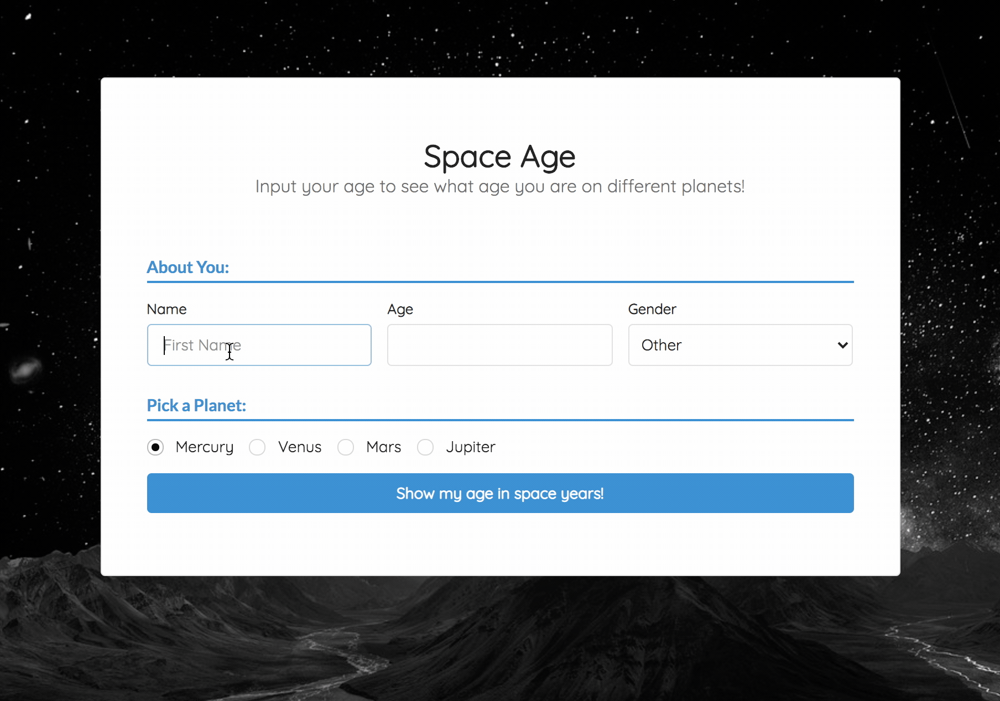

# Space Age

#### Epicodus Independent Project, 3.5.2020

#### By **Winter A. Runion**

### Description
_Lets users enter their age and the name of a planet to see how "old" they are on that planet. Built to practice bundling with webpack and Jest unit testing._ 

### Demo
App can be viewed at [wrunion.github.io/tdd-in-space-e20](https://wrunion.github.io/tdd-in-space-e20/)

  

### Specs
| Spec | Input | Output |
| :-------------     | :------------- | :------------- |
| **Should take a user's age, and return their age on a given planet**  | User Input: Age: 10, Planet: Mercury | Output: 41.67 |
| **Should determine the life expectancy of a user, based on demographic data**  | User Input: Gender: female | Output: 72 |
| **Should calculate life expectancy on a chosen planet**  | User Input: Age: 25 Planet: Jupiter | Output: 75.81 |
| **If user has surpassed planetary life expectancy, return a special message instead**  | User Input: Age: 95, Planet: Mars | Output: Congrats! You beat father time! You've lived 12.24 years longer than expected on Mars! 

### Project Requirements: 
- [x] Business logic is thoroughly tested with Jest.
- [x] Each spec was committed before writing its corresponding code.
- [x] Project utilizes ES6 features including classes, let and const.
- [x] Dependencies are managed with npm.
- [x] Webpack is used to lint, bundle, and process code.

### Contact

You're welcome to submit a pull request if you find any issues. You can reach me at winter@winterrunion.com.

### License
_This software is licensed under the MIT license._

_Copyright (c) 2020 **Winter A. Runion**_
